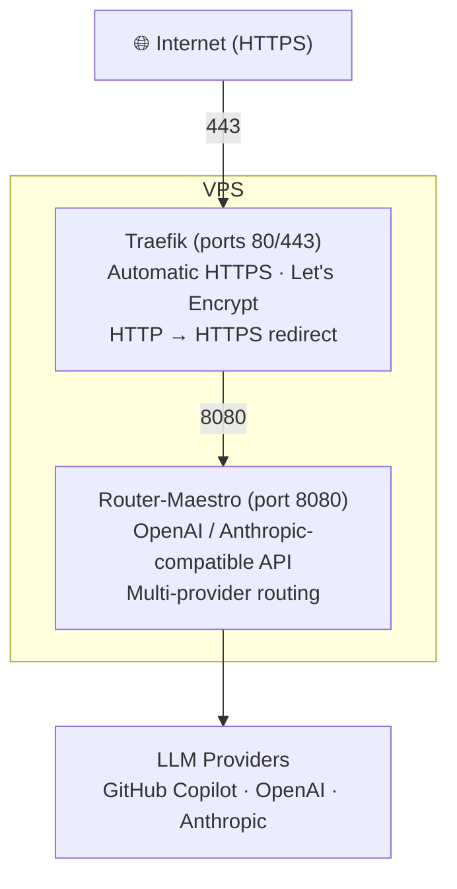

# Router-Maestro

[](https://github.com/MadSkittles/Router-Maestro/actions/workflows/ci.yml)
[](https://github.com/MadSkittles/Router-Maestro/actions/workflows/release.yml)

Router-Maestro is a local or self-hosted proxy that lets OpenAI-, Anthropic-, and Gemini-compatible clients use models from GitHub Copilot, OpenAI, Anthropic, and custom providers — with priority-based selection and automatic fallback.

## TL;DR

**Use GitHub Copilot's models (Claude, GPT-4o, o3-mini) with Claude Code or any OpenAI/Anthropic-compatible client.**

Router-Maestro acts as a proxy that gives you access to models from multiple providers through a unified API. Authenticate once with GitHub Copilot, and use its models anywhere that supports OpenAI or Anthropic APIs.

## Features

### Core

- **Multi-provider support**: GitHub Copilot (OAuth), OpenAI, Anthropic, and custom OpenAI-compatible endpoints
- **Dual API compatibility**: Both OpenAI (`/api/openai/v1/...`) and Anthropic (`/v1/messages`) API formats
- **Gemini API compatibility**: Gemini REST API format (`/api/gemini/v1beta/...`) for Gemini CLI/SDK
- **Cross-provider translation**: Seamlessly route OpenAI requests to Anthropic providers and vice versa
- **Intelligent routing**: Priority-based model selection with automatic fallback on failure
- **Deterministic model matching**: Public model IDs are provider-qualified, while convenient bare aliases (for example, `opus-4-6`) are matched by score and routed according to the configured priorities
- **CLI management**: Full command-line interface for configuration and server control
- **Docker ready**: Production-ready Docker images with Traefik integration
- **Configuration hot-reload**: Auto-reload config files every 5 minutes without server restart

### Advanced

- **1M context support**: Activate a catalog model whose base entry advertises a
  1M context window by selecting its synthetic `[1m]` key during
  `config claude-code` setup. The wizard displays Claude Code's native `[1m]`
  key but writes it with the `github-copilot/` provider scope, so it maps to the
  same base Copilot model even when another provider exposes the same upstream
  ID. It also raises Claude Code's auto-compact threshold
  (`CLAUDE_CODE_AUTO_COMPACT_WINDOW`) to 1M; Router-Maestro does not rewrite it
  to a dedicated `-1m` model suffix.
- **Capability-aware reasoning tiers**: `reasoning_effort` and Anthropic
  thinking controls stay on the selected base model. The ordered effort ladder
  is `minimal < low < medium < high < xhigh < max`. An advertised exact tier is
  passed through; otherwise Router-Maestro may substitute only the highest
  supported tier no greater than the request, or reject it when no such tier
  exists. Unknown tiers are rejected. `minimal` has no implicit token-budget
  equivalent, so a small `thinking.budget_tokens` value is not guessed to mean
  `minimal`. Copilot's known catalog-only `none` sentinel is preserved as model
  capability metadata, but it is not a client request tier, budget mapping, or
  downward-substitution target. Effort does not route through `-high` or
  `-xhigh` model suffixes.
- **Anthropic adaptive effort passthrough**: `output_config.effort` is preserved
  across standard and beta-native Anthropic routes. Explicit effort replaces
  an adaptive thinking budget, while manual `thinking.type="enabled"` retains
  its protocol-required `budget_tokens` when `budget_tokens < max_tokens`.
  Omitting `budget_tokens` uses the configured server default. The beta-native
  route rejects present token limits unless they are positive, non-boolean
  integers. If an exact reasoning tier is unavailable, Router-Maestro may use
  the highest advertised tier that does not exceed the request. It never
  silently raises reasoning effort, cost, or latency; a request with no valid
  lower tier is rejected.
- **Server-side `web_search`**: GitHub Copilot's model endpoints reject
  Anthropic's hosted `web_search` server tool ("The use of the web search tool
  is not supported"), because Copilot's own web search is an MCP tool run by the
  client, not an API capability. When enabled, Router-Maestro plays that client
  role itself: it advertises `web_search` as a function tool, intercepts the
  model's `tool_use`, runs the search, feeds the result back, and returns only
  the final answer. Searches reuse the stored GitHub Copilot credential, so no
  extra API key or quota is needed. Disabled by default — see
  [docs/web-search.md](docs/web-search.md).

## Table of Contents

- [Quick Start](#quick-start)
- [Core Concepts](#core-concepts)
  - [Model Identification](#model-identification)
  - [Auto-Routing](#auto-routing)
  - [Priority & Fallback](#priority--fallback)
  - [Cross-Provider Translation](#cross-provider-translation)
  - [Contexts](#contexts)
- [CLI Reference](#cli-reference)
- [API Reference](#api-reference)
- [Configuration](#configuration)
  - [Metrics & Observability](#metrics--observability)
- [Deployment](#deployment)
  - [Architecture](#architecture)
  - [Server and Client API Keys](#server-and-client-api-keys)
  - [Local with pip install](#local-with-pip-install)
  - [Option A: Remote Docker (No HTTPS)](#option-a-remote-docker-no-https)
  - [Option B: Production (Docker Compose + Traefik + HTTPS)](#option-b-production-docker-compose--traefik--https)
  - [Remote Management](#remote-management)
  - [Advanced Configuration](#advanced-configuration)
- [License](#license)
- [Changelog](#changelog)

## Quick Start

Get a local server running in 3 steps. The server (started locally or via Docker with `~/.config/router-maestro` mounted) auto-creates a `local` context with a generated API key — no manual `context add` is needed when client and server are on the same machine.

**Before you start, make sure you have:**

- Docker running locally (or skip to [Local with pip install](#local-with-pip-install))
- Python 3 with `pip` available for the `router-maestro` CLI on the host
- An active GitHub Copilot subscription
- Port 8080 free, or adjust `-p 8080:8080` in the Docker command below

> **Custom port:** If you use a different host port (e.g. `-p 8123:8080`), update the local context so the CLI connects to the correct port:
> ```bash
> router-maestro context update local --endpoint http://localhost:8123
> ```

> **About the Router-Maestro API key.** Router-Maestro has **one server key** (format `sk-rm-...`) that clients must send on inference, administration, and remote-management requests. Public health/docs and the independently configured metrics endpoint are exceptions. It is **not** an OpenAI / Anthropic / Gemini / GitHub token — it only authenticates clients to *your* Router-Maestro server. The server auto-generates and persists this key on first start (in `~/.config/router-maestro/contexts.json` or its Docker-mounted equivalent), so you usually never type it by hand: the CLI reads it from the active context and the `config claude-code/codex/gemini` wizards write it into each tool's settings for you. The two times you do touch it explicitly are (1) `router-maestro server show-key` to copy it into a raw `curl` or environment variable like `ROUTER_MAESTRO_API_KEY`, and (2) `router-maestro context add ... --api-key sk-rm-...` when pointing a client machine at a **remote** server (see [Deployment](#deployment)). If an authenticated request returns `401`, it almost always means the key it sent doesn't match what the server expects — re-run `server show-key` and compare.

<https://github.com/user-attachments/assets/8f60ec7a-4fbe-4342-9408-084073a4d48d>

### 1. Start the Server (Docker)

```bash
docker run -d --name router-maestro \
  -p 8080:8080 \
  -v ~/.local/share/router-maestro:/home/maestro/.local/share/router-maestro \
  -v ~/.config/router-maestro:/home/maestro/.config/router-maestro \
  likanwen/router-maestro:latest
```

Both volumes are required:

- `.local/share/router-maestro` persists GitHub Copilot OAuth tokens.
- `.config/router-maestro` persists the auto-generated server API key (in `contexts.json`). Because this directory is shared with the host, the host CLI sees the same `local` context as the container — no extra setup needed.

If you want a fixed key for automation, add `-e ROUTER_MAESTRO_API_KEY="sk-rm-..."`. The API key is the Router-Maestro server key, not an OpenAI, Anthropic, Gemini, or GitHub token. Every client, generated tool config, or raw API call must use the same key.

Confirm the server is up:

```bash
curl http://localhost:8080/health
# Expected: {"status":"healthy"}
```

> Prefer running without Docker? See [Local with pip install](#local-with-pip-install).

### 2. Authenticate with GitHub Copilot

Install the CLI on the host and run `auth login` against the local server. The OAuth device flow is hosted by the server; the CLI just renders the URL/code and polls for completion, so there is no need to `docker exec` into the container.

```bash
pip install router-maestro
router-maestro auth login github-copilot

# Follow the prompts in this terminal:
#   1. Visit https://github.com/login/device
#   2. Enter the displayed code
#   3. Authorize "GitHub Copilot Chat"
```

If you ever need the server API key (for example to paste into a raw `curl`):

```bash
router-maestro server show-key
```

### 3. Configure Your CLI Tool

The config commands read the endpoint and API key from the active context (`local` by default) and write them into the target tool's settings.

```bash
router-maestro config claude-code   # Claude Code (Anthropic-compatible)
router-maestro config codex         # OpenAI Codex (CLI / extension / app)
router-maestro config gemini        # Gemini CLI
```

For Codex, also export the same key on the client because the generated config references `ROUTER_MAESTRO_API_KEY`:

```bash
export ROUTER_MAESTRO_API_KEY="sk-rm-..."   # add to your shell profile
```

**Done!** Run `claude`, `codex`, or `gemini` and your requests route through Router-Maestro.

To smoke-test the full path without launching a client:

```bash
curl http://localhost:8080/api/openai/v1/models \
  -H "Authorization: Bearer $(router-maestro server show-key)"
# Expected: JSON list of available models
```

> **Deploying to another machine or a VPS?** See [Deployment](#deployment) for the remote-Docker and Compose + Traefik + HTTPS setups.

## Core Concepts

### Model Identification

Models are identified using the format `{provider}/{model-id}`:

| Example                           | Description                         |
| --------------------------------- | ----------------------------------- |
| `github-copilot/gpt-4o` | GPT-4o via GitHub Copilot |
| `github-copilot/claude-sonnet-4` | Claude Sonnet 4 via GitHub Copilot |
| `openai/gpt-4-turbo` | GPT-4 Turbo via OpenAI |
| `anthropic/claude-3-5-sonnet` | Claude 3.5 Sonnet via Anthropic |

Model-list endpoints and successful response `model` fields use this qualified
form. The response value identifies the candidate that actually executed the
request, so it can change after a permitted fallback without becoming
ambiguous. Qualification uses catalog provenance rather than guessing from the
text of an upstream ID. A raw upstream ID may itself contain `/` and remains the
complete suffix: provider `openrouter` plus raw ID `openrouter/auto` is exposed
as `openrouter/openrouter/auto`. Only a catalog value explicitly marked as an
already-public ID is decoded once.

Bare model IDs and fuzzy aliases remain valid input conveniences, but they do
not select or lock a provider. This includes an exact raw alias that contains a
slash. Use the complete public `provider/model-id` returned by a model-list
endpoint when provider identity matters. Other slash-containing inputs are
treated as provider-scoped; an unknown provider prefix returns `404` instead of
falling back to a cross-provider fuzzy match.

**Fuzzy matching**: You don't need to type exact model IDs. Router-Maestro will fuzzy-match common variations:

| You type              | Resolves to                      |
| --------------------- | -------------------------------- |
| `Opus 4.6`            | `claude-opus-4-6-20250617`       |
| `opus-4-6`            | `claude-opus-4-6-20250617`       |
| `claude-sonnet-4.5`   | `claude-sonnet-4-5-20250929`     |
| `anthropic/sonnet-4-5`| Sonnet 4.5 via Anthropic only    |

The highest-confidence fuzzy match wins. A date/version suffix is used only to
break ties within the same normalized model family. Low-confidence or
effectively tied cross-family matches are rejected as ambiguous instead of
being resolved by an unrelated model's newer date.

### Auto-Routing

Use the special model name `router-maestro` for automatic provider selection:

```json
{"model": "router-maestro", "messages": [...]}
```

The router will try models in priority order and fall back to the next on failure.

### Priority & Fallback

**Priority** determines which model is tried first when using auto-routing.

```bash
# Set priorities
router-maestro model priority add github-copilot/claude-sonnet-4 --position 1
router-maestro model priority add github-copilot/gpt-4o --position 2

# View priorities
router-maestro model priority list
```

**Fallback** triggers only after a retryable execution failure, such as a
transport error, rate limit, retryable upstream status, or malformed upstream
response before a streaming response is committed:

| Strategy     | Behavior                             |
| ------------ | ------------------------------------ |
| `priority` | Try next model in priorities list |
| `same-model` | Try same model on different provider |
| `none` | Fail immediately |

Configure in `~/.config/router-maestro/priorities.json`:

```json
{
  "priorities": ["github-copilot/claude-sonnet-4", "github-copilot/gpt-4o"],
  "fallback": {"strategy": "priority", "maxRetries": 2}
}
```

An explicit `provider/model-id` remains the primary candidate. If it is absent
from the priority list, the configured priorities are still eligible after a
retryable execution failure, with the primary removed from duplicates. Static
capability mismatches and invalid or unsupported request options return the
entry protocol's native `400` response and do not switch models. Once a stream
has emitted its first provider chunk, a later failure is surfaced in that same
stream and Router-Maestro never replays the request on another candidate.

Streaming has a strict terminal contract. A stream succeeds only after an
explicit successful provider terminal; clean EOF without one is an
`unexpected_eof`, not success. Failures discovered before an SSE response is
returned use the entry protocol's non-2xx JSON error. After the HTTP response
has started, its status is already committed (normally `200`), so an error,
incomplete result, or unexpected EOF is encoded as exactly one protocol-native
in-stream terminal instead. The standard Anthropic route may send a `ping`
before opening a slow upstream stream; a failure after that ping is therefore
post-commit even though no model content has arrived yet.

OpenAI Responses preserves the upstream response's business status. A native
Responses result with `status: "incomplete"`, `"failed"`, or `"cancelled"`
remains an HTTP `200` Responses object/event with that status; it is not
manufactured into `completed`. Transport failures and malformed provider
payloads remain errors. When a failed/cancelled Responses result is bridged to
Chat, Anthropic, or Gemini, whose non-stream response schemas cannot represent
that native status, Router-Maestro returns that entry protocol's error envelope.

### Cross-Provider Translation

Router-Maestro automatically translates between OpenAI and Anthropic formats:

```bash
# Use Anthropic API with OpenAI provider
POST /v1/messages  {"model": "openai/gpt-4o", ...}

# Use OpenAI API with Anthropic provider
POST /api/openai/v1/chat/completions  {"model": "anthropic/claude-3-5-sonnet", ...}
```

Accepted semantic options are either preserved, translated, or rejected; they
are not silently dropped. Unsupported options use the client's native error
shape (OpenAI, Anthropic, or Gemini) with HTTP `400`. Reasoning-tier
substitution is downward-only across the ordered
`minimal < low < medium < high < xhigh < max` ladder. Unknown tier names are
rejected, and `minimal` is never inferred from a token budget because no
documented budget equivalent exists.

Omitted temperature remains omitted through Chat, Responses, and Gemini
translation. An explicit value, including `1.0`, remains explicit. Copilot's
Chat transport accepts the explicit value, while Copilot's Responses transport
rejects every explicit temperature with an OpenAI-native HTTP `400` before
provider I/O. OpenAI Responses reasoning currently represents only
`reasoning.effort`; `reasoning.summary` and other sibling fields are rejected
with their exact parameter path instead of being ignored.

The beta Anthropic endpoint uses Copilot's native Anthropic transport when the
selected model advertises it. If that transport is unavailable, the same
selected model is adapted through the standard translated path. This is a
transport adaptation, not permission to choose a different model; model
fallback still requires a retryable execution failure.

For standard Anthropic thinking requests, budget and reasoning validation use
the capability and output-token snapshot of the same frozen route candidate
that will execute the request. Validation never consults a different provider's
same-named catalog entry and then silently changes candidates.

OpenAI Chat and Responses preserve refusals as typed `refusal` data, including
streaming deltas and assistant history. Anthropic and Gemini do not expose an
equivalent refusal wire type, so only those protocol boundaries map refusal
content to text.

For OpenAI Chat streaming, `stream_options: {"include_usage": true}` emits a
final usage-only chunk with `choices: []` immediately before `[DONE]`.
Explicit `false` suppresses downstream usage; omitting `stream_options` keeps
Router-Maestro's legacy streaming shape. Invalid stream options are rejected
with an OpenAI-native `400` before the provider call.

### Contexts

A **context** is a named connection profile stored on the client machine. It contains the endpoint URL and Router-Maestro server API key for one deployment, so the same CLI can manage local Docker containers, remote VPS deployments, and other Router-Maestro servers.

| Context  | Use Case                                   |
| -------- | ------------------------------------------ |
| `local` | Default context for `router-maestro server start` |
| `docker` | Connect to a local Docker container |
| `my-vps` | Connect to a remote VPS deployment |

```bash
# Add a context with the server API key from `server show-key`
router-maestro context add my-vps --endpoint https://api.example.com --api-key sk-rm-...

# Switch contexts
router-maestro context set my-vps

# All CLI commands now target the remote server
router-maestro model list
```

## CLI Reference

### Server

| Command                    | Description        |
| -------------------------- | ------------------ |
| `server start --port 8080` | Start the server   |
| `server status` | Show server status |
| `server show-key` | Show current context API key |

### Authentication

| Command                 | Description                    |
| ----------------------- | ------------------------------ |
| `auth login [provider]` | Authenticate with a provider   |
| `auth logout <provider>` | Remove authentication |
| `auth list` | List authenticated providers |

### Models

| Command                            | Description            |
| ---------------------------------- | ---------------------- |
| `model list`                       | List available models  |
| `model refresh` | Refresh models cache |
| `model priority list` | Show priorities |
| `model priority add <model> --position <n>` | Add or move a priority |
| `model fallback show` | Show fallback config |

### Contexts (Remote Management)

| Command                                              | Description          |
| ---------------------------------------------------- | -------------------- |
| `context current`                                    | Show current context |
| `context list` | List all contexts |
| `context set <name>` | Switch context |
| `context update <name> --endpoint <url> [--api-key <key>]` | Update context endpoint/key |
| `context add <name> --endpoint <url> --api-key <key>` | Add remote context |
| `context test` | Test connection |

### Other

| Command              | Description                   |
| -------------------- | ----------------------------- |
| `config claude-code` | Generate Claude Code settings |
| `config codex`       | Generate Codex config (CLI/Extension/App) |
| `config gemini`      | Generate Gemini CLI .env      |

## API Reference

### OpenAI-Compatible

```bash
# Chat completions — full curl example
curl http://localhost:8080/api/openai/v1/chat/completions \
  -H "Authorization: Bearer sk-rm-..." \
  -H "Content-Type: application/json" \
  -d '{
    "model": "github-copilot/gpt-4o",
    "messages": [{"role": "user", "content": "Hello"}],
    "stream": false
  }'

# List models
GET /api/openai/v1/models
```

The list `id` and every successful Chat/Responses response `model` are
provider-qualified (`provider/model-id`). A fallback response reports the
candidate that actually served it.

### Anthropic-Compatible

```bash
# Messages
POST /v1/messages
POST /api/anthropic/v1/messages
{
  "model": "github-copilot/claude-sonnet-4",
  "max_tokens": 1024,
  "messages": [{"role": "user", "content": "Hello"}]
}

# Count tokens
POST /v1/messages/count_tokens
```

### Admin

```bash
POST /api/admin/models/refresh   # Refresh model cache
```

### Gemini-Compatible

```bash
# Generate content (non-streaming)
POST /api/gemini/v1beta/models/{model}:generateContent
{
  "contents": [{"role": "user", "parts": [{"text": "Hello"}]}]
}

# Stream generate content (SSE)
POST /api/gemini/v1beta/models/{model}:streamGenerateContent?alt=sse
{
  "contents": [{"role": "user", "parts": [{"text": "Hello"}]}]
}

# Count tokens
POST /api/gemini/v1beta/models/{model}:countTokens
{
  "contents": [{"role": "user", "parts": [{"text": "Hello"}]}]
}
```

## Configuration

### File Locations

Following XDG Base Directory specification:

| Type       | Path                               | Contents                     |
| ---------- | ---------------------------------- | ---------------------------- |
| **Config** | `~/.config/router-maestro/` | |
| | `providers.json` | Custom provider definitions |
| | `priorities.json` | Model priorities and fallback |
| | `contexts.json` | Deployment contexts |
| **Data** | `~/.local/share/router-maestro/` | |
| | `auth.json` | Provider OAuth and API-key credentials |
| | `server.json` | Legacy server state; current server API keys are stored in `contexts.json` |

### Custom Providers

Add OpenAI-compatible providers in `~/.config/router-maestro/providers.json`:

```json
{
  "providers": {
    "ollama": {
      "type": "openai-compatible",
      "baseURL": "http://localhost:11434/v1",
      "models": {
        "llama3": {"name": "Llama 3"},
        "mistral": {"name": "Mistral 7B"}
      },
      "options": {
        "allow_unauthenticated": true
      }
    }
  }
}
```

Custom-provider credentials are resolved in this order:

1. A non-empty environment variable. By default its name is the provider ID in
   uppercase with punctuation replaced by underscores, followed by `_API_KEY`.
2. An API key saved in Router-Maestro's credential repository with
   `router-maestro auth login <provider>`.
3. No credential, only when `options.allow_unauthenticated` is explicitly
   `true`. Anonymous requests do not include an `Authorization` header.

For example, `ollama` uses `OLLAMA_API_KEY` and `my-provider` uses
`MY_PROVIDER_API_KEY`:

```bash
export OLLAMA_API_KEY="sk-..."
```

Set `options.api_key_env` to a valid environment-variable name when a provider
needs a different name. Provider definitions and their authentication
requirements are obtained from the active server, so the same login command
works for local and remote contexts. Only a local context may fall back to the
local `providers.json` while its server is unavailable.

The supported runtime options are `api_key_env` and
`allow_unauthenticated`. Router-Maestro preserves unknown option keys from
older `providers.json` files when loading and saving, but ignores them at
runtime. If one provider definition is invalid, it is skipped with a sanitized
diagnostic while other valid custom providers remain available.

### Hot-Reload

Configuration files are automatically reloaded every 5 minutes:

| File               | Auto-Reload      |
| ------------------ | ---------------- |
| `priorities.json` | ✓ (5 min) |
| `providers.json` | ✓ (5 min) |
| `auth.json` | Requires restart |

Force immediate reload:

```bash
router-maestro model refresh
```

### Metrics & Observability

Router-Maestro exposes a top-level Prometheus endpoint at `/metrics` with
HTTP request counters, request duration histograms, and request IDs on
responses via `X-Request-ID`. Streaming request durations are recorded after
the response body finishes.

```bash
curl http://localhost:8080/metrics
```

By default `/metrics` is public. Set `ROUTER_MAESTRO_METRICS_TOKEN` to require
an independent metrics token:

```bash
ROUTER_MAESTRO_METRICS_TOKEN="metrics-secret" router-maestro server start
curl http://localhost:8080/metrics -H "Authorization: Bearer metrics-secret"
```

See [docs/observability.md](docs/observability.md) for scrape examples, metric
labels, and troubleshooting guidance.

## Deployment

### Architecture



- **Traefik** — reverse proxy that handles TLS termination and auto-renews HTTPS certificates via Let's Encrypt. Only needed for public-facing deployments.
- **Router-Maestro** — the API server. Listens on port 8080, requires its API key for inference and administration requests, and routes inference to configured LLM providers. Health/docs are public; metrics has its own optional token.

### Server and Client API Keys

Router-Maestro currently has one server API key. The same
`ROUTER_MAESTRO_API_KEY` protects inference routes and `/api/admin/*`; every
inference client and remote CLI management command must send that key. A
separate administrator key is not currently supported. Public health/docs and
the independently configured metrics endpoint are the exceptions described in
their respective sections.

You can provide the key explicitly with `ROUTER_MAESTRO_API_KEY` or `router-maestro server start --api-key ...`. If you do not, the server generates a `sk-rm-...` key on first start and persists it in the `local` context inside `contexts.json` (the Docker image runs the same `server start` command, so the same behavior applies there). To read it later:

```bash
router-maestro server show-key                                # local install / inside the container
docker exec router-maestro router-maestro server show-key      # remote Docker host (run over SSH)
docker compose exec router-maestro router-maestro server show-key   # Docker Compose
```

Authentication (`router-maestro auth login github-copilot`) and config (`router-maestro config claude-code` / `codex` / `gemini`) always run from the client and use the active context's endpoint + key. They never need `docker exec` because the server hosts the OAuth device flow and exposes it via the admin HTTP API.

### Local with pip install

If you would rather not use Docker, run the server directly on the same machine. The `local` context is auto-created on first start, so the host CLI works against `localhost:8080` with zero context setup.

```bash
pip install router-maestro
router-maestro server start --port 8080            # leave running in this terminal
router-maestro auth login github-copilot           # in a second terminal
router-maestro config claude-code                  # or: config codex / config gemini
```

For a fixed key, set `ROUTER_MAESTRO_API_KEY` before `server start` or pass `--api-key`.

### Option A: Remote Docker (No HTTPS)

**Use when:** running on another machine on your LAN/VPN, or behind an existing reverse proxy (Nginx, Caddy, etc.) that handles TLS.

**Prerequisites:** Docker installed on the server host; SSH access to that host; the Router-Maestro CLI installed on your client machine (`pip install router-maestro`).

**Step 1 — Start the container on the server host**

```bash
docker run -d --name router-maestro \
  -p 8080:8080 \
  -v ~/.local/share/router-maestro:/home/maestro/.local/share/router-maestro \
  -v ~/.config/router-maestro:/home/maestro/.config/router-maestro \
  likanwen/router-maestro:latest
```

The server generates and persists an API key automatically. For a fixed key, add `-e ROUTER_MAESTRO_API_KEY="sk-rm-..."`.

**Step 2 — Read the server API key from the server host**

```bash
ssh user@server-host docker exec router-maestro router-maestro server show-key
```

Copy the printed key for the next step.

**Step 3 — Add the server as a context on your client machine**

```bash
router-maestro context add my-server \
  --endpoint http://server-host:8080 \
  --api-key "sk-rm-..."

router-maestro context set my-server
router-maestro context test          # verify endpoint + key
```

**Step 4 — Authenticate with GitHub Copilot from the client**

The auth command targets the active context, so this runs against the remote server over HTTP — no `docker exec` needed.

```bash
router-maestro auth login github-copilot
# 1. Visit the URL shown in this terminal
# 2. Enter the displayed code
# 3. Authorize "GitHub Copilot Chat"
```

**Step 5 — Configure your CLI tool from the client**

```bash
router-maestro config claude-code   # or: config codex / config gemini
```

**Step 6 — Verify**

```bash
curl http://server-host:8080/health
# Expected: {"status":"healthy"}

curl http://server-host:8080/api/openai/v1/models \
  -H "Authorization: Bearer sk-rm-..."
# Expected: JSON list of available models
```

### Option B: Production (Docker Compose + Traefik + HTTPS)

**Use when:** deploying to a public-facing VPS with a domain name. Provides automatic HTTPS via Let's Encrypt with the Cloudflare DNS challenge.

**Prerequisites:**
- A VPS with Docker and Docker Compose installed
- A domain name (e.g., `api.example.com`) with DNS pointing to your VPS
- A Cloudflare account managing your domain's DNS (for automatic HTTPS)
- The Router-Maestro CLI installed on your client machine (`pip install router-maestro`)

**Step 1 — Clone the repository on the VPS**

```bash
git clone https://github.com/MadSkittles/Router-Maestro.git
cd Router-Maestro
```

**Step 2 — Configure environment variables**

```bash
cp .env.example .env
```

Edit `.env` with your values:

| Variable | Description | Example |
|----------|-------------|---------|
| `DOMAIN` | Your domain pointing to this VPS | `api.example.com` |
| `CF_DNS_API_TOKEN` | Cloudflare API token with `Zone:DNS:Edit` permission. [Generate here](https://dash.cloudflare.com/profile/api-tokens) | `abc123...` |
| `ACME_EMAIL` | Email for Let's Encrypt certificate expiry notifications | `you@example.com` |
| `ROUTER_MAESTRO_API_KEY` | Optional fixed server API key. Leave blank, and do not set it in the shell running Docker Compose, to let the server generate and persist one. | `sk-rm-...` |
| `ROUTER_MAESTRO_LOG_LEVEL` | Log verbosity (`DEBUG`, `INFO`, `WARNING`, `ERROR`) | `INFO` |
| `TRAEFIK_DASHBOARD_AUTH` | (Optional) Basic auth for Traefik dashboard. Generate with `htpasswd -nB admin`, then escape `$` as `$$` | `admin:$$2y$$05$$...` |

**Step 3 — Start the services**

```bash
docker compose up -d
```

This starts both Traefik (reverse proxy) and Router-Maestro. Traefik will automatically obtain an HTTPS certificate for your domain.

**Step 4 — Read the server API key from the VPS**

```bash
docker compose exec router-maestro router-maestro server show-key
```

If you set `ROUTER_MAESTRO_API_KEY` in `.env` or in the shell running Docker Compose, this prints that key. Otherwise it prints the generated key stored in the server's mounted config.

**Step 5 — Add the VPS as a context on your client machine**

```bash
router-maestro context add my-vps \
  --endpoint https://api.example.com \
  --api-key "sk-rm-..."

router-maestro context set my-vps
router-maestro context test
```

**Step 6 — Authenticate with GitHub Copilot from the client**

```bash
router-maestro auth login github-copilot
# Targets the VPS through the active context — no docker compose exec needed.
# 1. Visit the URL shown
# 2. Enter the displayed code
# 3. Authorize "GitHub Copilot Chat"
```

**Step 7 — Configure your CLI tool from the client**

```bash
router-maestro model list           # confirm models load from the VPS
router-maestro config claude-code   # or: config codex / config gemini
```

For Codex, also export the same key on the client because the generated config references `ROUTER_MAESTRO_API_KEY`:

```bash
export ROUTER_MAESTRO_API_KEY="sk-rm-..."   # add to your shell profile
```

**Step 8 — Verify**

```bash
curl https://api.example.com/health
# Expected: {"status":"healthy"}

curl https://api.example.com/api/openai/v1/models \
  -H "Authorization: Bearer sk-rm-..."
# Expected: JSON list of available models
```

### Remote Management

Contexts let you manage any Router-Maestro server (local or remote) from your local CLI:

```bash
# Add a remote server with the server API key from `server show-key`
router-maestro context add my-vps --endpoint https://api.example.com --api-key sk-rm-...

# Switch between servers
router-maestro context set my-vps     # target remote VPS
router-maestro context set local      # target local server

# Test the connection
router-maestro context test

# All commands now target the active context
router-maestro model list
router-maestro auth login github-copilot
```

### Advanced Configuration

For additional deployment options, see [docs/deployment.md](docs/deployment.md):

- Alternative DNS providers (AWS Route53, DigitalOcean, GoDaddy, Namecheap, etc.)
- HTTP challenge setup (when DNS challenge is not available)
- Traefik dashboard configuration and security
- Complete environment variables reference

### Stream Guards & Audit Tracing

Router-Maestro includes runtime stream protection and optional per-request tracing.

**Stream Guards** (enabled by default in `priorities.json`):

- **Leak Guard** — detects when Copilot-served Claude models emit internal protocol markup (control envelopes, XML tool calls) as plain text. Control envelopes abort the stream (client retries); invoke leaks are recovered into structured tool_use.
- **Runaway Guard** — aborts streams with degenerate generation patterns (infinite tiny fragments or excessive byte volume).

Configure in `~/.config/router-maestro/priorities.json`:
```json
{
  "guards": {
    "leak_guard": { "enabled": true },
    "runaway_guard": { "enabled": true, "max_bytes": 10000000 }
  },
  "beta_strip": ["output-128k-*"]
}
```

The five streaming encoders (OpenAI Chat, OpenAI Responses, standard
Anthropic, beta-native Anthropic, and Gemini) attach these guards to their
stream processing. `beta_strip` is also live: matching tokens are removed from
the inbound `anthropic-beta` header before Copilot transport, and remaining
tokens are forwarded. The broader request context is separate from this stream
pipeline: it owns one immutable config/router generation, request ID, audit,
terminal outcome, and cleanup for streaming and non-stream inference and token
counting routes. Streaming cleanup finishes at the final ASGI body frame, not
when the endpoint returns a stream object.

**Audit Tracing** (opt-in, for debugging):

```bash
# Enable via env var
ROUTER_MAESTRO_TRACE=1 router-maestro server start

# Or in priorities.json
{ "audit": { "enabled": true } }
```

Each traced request writes a directory under
`~/.local/share/router-maestro/traces/{request_id}/`. Artifacts are lifecycle
records, not a fixed four-file bundle:

- `inbound.json` — the client request
- `upstream.json`, `upstream_2.json`, ... — upstream request observations in order
- `upstream_resp.json`, `upstream_resp_2.json`, ... — upstream response
  observations, numbered independently in response order
- `outbound.json` — wire status, timing, and semantic terminal outcome

Some early failures have no upstream artifact, while fallback, authentication
retry, catalog, or token-count traffic may produce multiple attempt records.
The recognized `Authorization`, `X-API-Key`, and `X-Goog-API-Key` headers and
common credential-shaped payload keys are redacted before the trace is written
asynchronously. Treat traces as sensitive because prompts, model output, and
unrecognized application-specific headers can still contain private data.

For Docker, mount a volume to persist traces:
```bash
docker run ... -v ./traces:/home/maestro/.local/share/router-maestro/traces ...
```

## License

MIT License - see [LICENSE](LICENSE) file.

## Changelog

See [CHANGELOG.md](CHANGELOG.md) for release history.

## Contributing

Contributions are welcome! Please feel free to submit a Pull Request.

### Local Integration Tests

The live-backend integration tests are local-only and are not part of GitHub
Actions. They start a local Router-Maestro server, reuse your existing
Router-Maestro config/auth files, and send requests to the real GitHub Copilot
backend. The suite covers model invocation paths only: OpenAI Chat, OpenAI
Responses, Anthropic Messages/count_tokens, Gemini generateContent/stream/countTokens,
tool calls, streaming, usage accounting, Anthropic thinking budgets and
`output_config.effort`, OpenAI reasoning_effort, Gemini-family API calls, and the
full Copilot model matrix by default. Admin endpoints are intentionally not
covered by these tests.

Prerequisites:

```bash
uv run router-maestro auth login github-copilot
```

Run them explicitly:

```bash
make integration-test
```

Optional overrides:

```bash
RM_INTEGRATION_MODEL=github-copilot/gpt-4o make integration-test
RM_INTEGRATION_TOOL_MODEL=github-copilot/gpt-4o make integration-test
RM_INTEGRATION_RESPONSES_MODEL=github-copilot/gpt-5.4-mini make integration-test
RM_INTEGRATION_MODELS=github-copilot/gpt-4o,github-copilot/claude-sonnet-4.5 make integration-test
RM_INTEGRATION_MAX_MODELS=8 make integration-test
RM_INTEGRATION_MAX_REASONING_MODELS=3 make integration-test
RM_INTEGRATION_MAX_REASONING_MODELS=0 make integration-test  # full reasoning sweep
```
